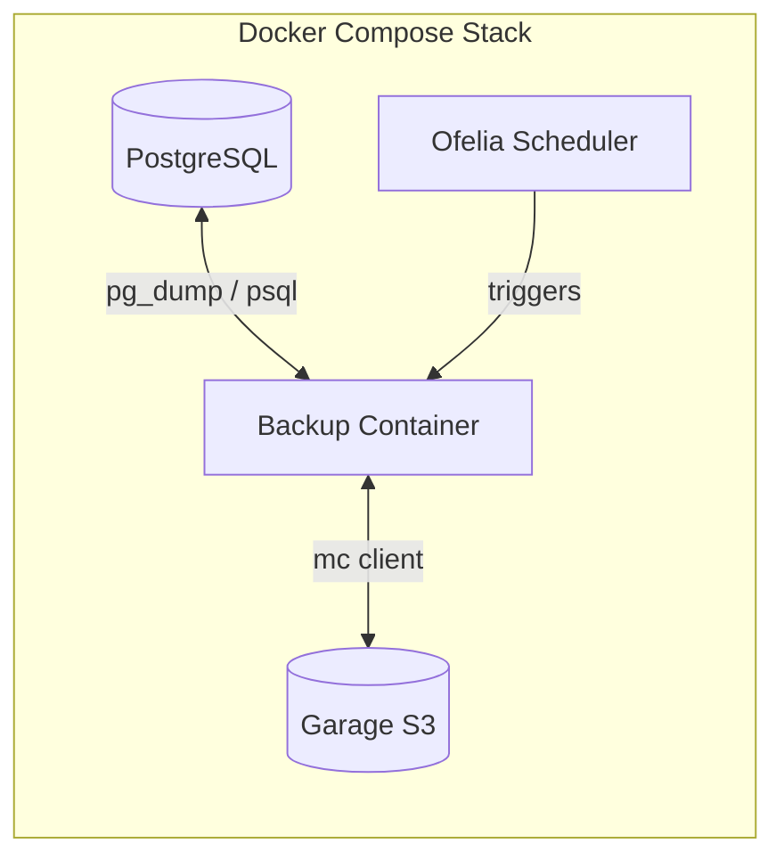

# PostgreSQL Backup Solution

A [Docker Compose](https://docs.docker.com/compose/)-based [PostgreSQL](https://www.postgresql.org/) backup solution that performs periodic [`pg_dump`](https://www.postgresql.org/docs/current/app-pgdump.html) backups and uploads them to S3-compatible storage (AWS S3, Backblaze B2, etc). We use [Garage](https://garagehq.deuxfleurs.fr/) for local testing.

## Architecture



## Quick Start

1. **Clone and configure:**

   ```bash
   cp .env.example .env
   # Edit .env with your settings
   ```

2. **Start all services:**

   ```bash
   make up
   ```

3. **Trigger a manual backup:**

   ```bash
   make backup
   ```

4. **List available backups:**

   ```bash
   make list-backups
   ```

5. **Restore a backup:**
   ```bash
   make restore FILE=2024/01/15/myapp_120000.sql.gz
   ```

## Configuration

All configuration is done via environment variables. See `.env.example` for available options:

| Variable            | Default              | Description                   |
| ------------------- | -------------------- | ----------------------------- |
| `POSTGRES_VERSION`  | `16`                 | PostgreSQL version            |
| `POSTGRES_DB`       | `myapp`              | Database name                 |
| `POSTGRES_USER`     | `postgres`           | Database user                 |
| `POSTGRES_PASSWORD` | `changeme`           | Database password             |
| `BACKUP_SCHEDULE`   | `0 */6 * * *`        | Cron schedule (every 6 hours) |
| `S3_ENDPOINT`       | `http://garage:3900` | S3 endpoint URL               |
| `S3_BUCKET`         | `backups`            | S3 bucket name                |
| `S3_ACCESS_KEY`     | `garage-access-key`  | S3 access key                 |
| `S3_SECRET_KEY`     | `garage-secret-key`  | S3 secret key                 |

## Available Commands

```bash
make help           # Show all available commands
make up             # Start all services
make down           # Stop all services
make backup         # Trigger manual backup
make restore FILE=x # Restore specific backup
make test           # Run integration tests
make logs           # Show logs from all services
make clean          # Stop services and remove volumes
make shell-postgres # Open psql in postgres container
make shell-backup   # Open shell in backup container
make list-backups   # List all backups in S3
```

## Backup Storage Structure

Backups are stored in S3 with the following path structure:

```
backups/
└── YYYY/
    └── MM/
        └── DD/
            └── dbname_HHMMSS.sql.gz
```

Example: `backups/2024/01/15/myapp_120000.sql.gz`

## Adapting for Production

### Using External S3 Storage

To use AWS S3, MinIO, or another S3-compatible service instead of Garage:

1. Remove the `garage` and `garage-init` services from `docker-compose.yml`
2. Update `.env` with your S3 credentials:
   ```bash
   S3_ENDPOINT=https://s3.amazonaws.com
   S3_BUCKET=your-bucket-name
   S3_ACCESS_KEY=your-access-key
   S3_SECRET_KEY=your-secret-key
   ```

### Customizing the Backup Schedule

The default schedule runs backups every 6 hours. Modify `BACKUP_SCHEDULE` using cron format:

```bash
# Every hour
BACKUP_SCHEDULE=0 * * * *

# Daily at midnight
BACKUP_SCHEDULE=0 0 * * *

# Weekly on Sunday at 2am
BACKUP_SCHEDULE=0 2 * * 0
```

### Adding Backup Retention

The backup script doesn't automatically delete old backups. To implement retention:

1. Add a cleanup script to `docker/backup/scripts/cleanup.sh`
2. Add an Ofelia label for scheduled cleanup
3. Or use S3 lifecycle policies on your bucket

## Testing

Run the integration test suite:

```bash
make test
```

This will:

1. Start all services with ephemeral volumes
2. Insert test data
3. Trigger a backup
4. Verify backup exists in S3
5. Restore to a second PostgreSQL instance
6. Verify restored data matches original
7. Clean up

## Troubleshooting

### Services won't start

Check service health:

```bash
docker compose ps
docker compose logs
```

### Backup fails

Check backup container logs:

```bash
make logs-backup
```

Verify S3 connectivity:

```bash
docker compose exec backup mc ls s3/
```

### Restore fails

Ensure the backup file exists:

```bash
make list-backups
```

Check for active connections blocking restore:

```bash
docker compose exec postgres psql -U postgres -c "SELECT * FROM pg_stat_activity WHERE datname='myapp';"
```

## CI/CD

This project includes a GitHub Actions workflow that:

1. **Lints** Dockerfiles, shell scripts, and compose config
2. **Runs integration tests** with full backup/restore cycle
3. **Captures logs** on failure for debugging

The workflow runs on:

- Push to `main` branch
- Pull requests to `main` branch

## License

MIT
